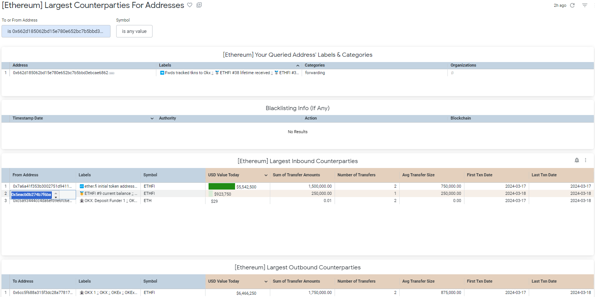

# 🟡 ether.fi

1\. What The Team Claims They'll Do

The initial allocation of ETHFI is described both [by the team](https://etherfi.gitbook.io/etherfi/governance/ethfi-allocations) and in a [Binance research piece](https://www.binance.com/en/research/projects/etherfi).&#x20;

The Binance research piece tells us the initial circulating supply should be 115.2 million ETHFI tokens out of a total of 1 billion.&#x20;

<figure><figcaption>
Source: <a href="https://www.binance.com/en/research/projects/etherfi">https://www.binance.com/en/research/projects/etherfi</a>
</figcaption></figure>

It also gives the end-state breakdown allocation as:

<figure><figcaption>
Source: <a href="https://www.binance.com/en/research/projects/etherfi">https://www.binance.com/en/research/projects/etherfi</a>
</figcaption></figure>

These would be the total amount handed out over time.&#x20;

The Binance research piece tells us there are a range of vesting schedules and the like.&#x20;

From these we get an approximate initial ETHFI token allocation, which we know should total 11.52%:

* 2% Launchpool
* 5.5% Airdrop
* 3% Liquidity
* 1.02% Investors and Advisors

While the Binance research piece does not directly address the DAO treasury initial allocation, it is clear the initial circulating supply should be 11.52%.&#x20;

So, at most, there is a little confusion over how that amount is allocated.

## 2. Finding Possible Team Wallets

For any given project, the first step to figure out if the token allocations were done correctly is to identify possible team wallets.

### 2.1 The Team's Claims

Almost all token projects will provide a list of addresses they identify for specific purposes and ether.fi is no different. The ether.fi team documents a large number of addresses [here](https://etherfi.gitbook.io/etherfi/contracts-and-integrations/deployed-contracts), reproduced below for your ease of access.&#x20;

The following contracts were deployed by the ether.fi team on the Ethereum mainnet.&#x20;

<table><thead><tr><th width="240">Contract</th><th>Address</th></tr></thead><tbody><tr><td>Address Provider</td><td>0x8487c5F8550E3C3e7734Fe7DCF77DB2B72E4A848</td></tr><tr><td>Early Adopter Pool</td><td>0x7623e9dc0da6ff821ddb9ebaba794054e078f8c4</td></tr><tr><td>Auction Manager</td><td>0x00C452aFFee3a17d9Cecc1Bcd2B8d5C7635C4CB9</td></tr><tr><td>Staking Manager</td><td>0x25e821b7197B146F7713C3b89B6A4D83516B912d</td></tr><tr><td>Etherfi Nodes Manager</td><td>0x8B71140AD2e5d1E7018d2a7f8a288BD3CD38916F</td></tr><tr><td>BNFT</td><td>0x6599861e55abd28b91dd9d86A826eC0cC8D72c2c</td></tr><tr><td>TNFT</td><td>0x7B5ae07E2AF1C861BcC4736D23f5f66A61E0cA5e</td></tr><tr><td>eETH</td><td>0x35fA164735182de50811E8e2E824cFb9B6118ac2</td></tr><tr><td>WeETH</td><td>0xCd5fE23C85820F7B72D0926FC9b05b43E359b7ee</td></tr><tr><td>WithdrawRequestNFT</td><td>0x7d5706f6ef3F89B3951E23e557CDFBC3239D4E2c</td></tr><tr><td>Liquidity Pool</td><td>0x308861A430be4cce5502d0A12724771Fc6DaF216</td></tr><tr><td>Membership Manager</td><td>0x3d320286E014C3e1ce99Af6d6B00f0C1D63E3000</td></tr><tr><td>Membership NFT</td><td>0xb49e4420eA6e35F98060Cd133842DbeA9c27e479</td></tr><tr><td>Node Operator Manager</td><td>0xd5edf7730ABAd812247F6F54D7bd31a52554e35E</td></tr><tr><td>ETHFI</td><td>0xFe0c30065B384F05761f15d0CC899D4F9F9Cc0eB</td></tr><tr><td>Treasury</td><td>0x6329004E903B7F420245E7aF3f355186f2432466</td></tr><tr><td>LoyaltyPointsMarketSafe</td><td>0x3165542a27D40fBE0DAd050614180F01a4f4eE24</td></tr><tr><td>Liquifier</td><td>0x9ffdf407cde9a93c47611799da23924af3ef764f</td></tr><tr><td>EtherFiOracle</td><td>0x57AaF0004C716388B21795431CD7D5f9D3Bb6a41</td></tr><tr><td>EtherFiAdmin</td><td>0x0EF8fa4760Db8f5Cd4d993f3e3416f30f942D705</td></tr><tr><td>EtherFiTimelock</td><td>0x9f26d4C958fD811A1F59B01B86Be7dFFc9d20761</td></tr><tr><td>Liquid Vault</td><td>0xeA1A6307D9b18F8d1cbf1c3Dd6aad8416C06a221</td></tr></tbody></table>

### 2.2 Finding Out What Actually Happened&#x20;

On DashArgos, you can easily find out whether the initial token allocation was performed correctly by using the premade largest senders and receivers Dashboard.&#x20;

DashArgos subscribers can interact with the premade Dashboard [here](https://dashargos.chainargos.com/dashboards/162?Relative+Months+Prior=%5B0%2C48%5D\&Symbol=ETHFI), if you're not a subscriber, please read on.&#x20;

At the time the dashboard was run, on May 5, 2024, it looked like this:&#x20;

#### 2.2.1 Largest Senders of ETHFI&#x20;

<figure><figcaption>
Source: DashArgos [Ethereum] Largest Senders and Receivers premade Dashboard. 
</figcaption></figure>

#### 2.2.2 Largest Receivers of ETHFI

<figure><figcaption>
Source: DashArgos [Ethereum] Largest Senders and Receivers premade Dashboard. 
</figcaption></figure>

The easiest place to start is to scan and review which are the biggest receivers and senders of tokens and see if that corresponds with what the ether.fi team has declared.&#x20;

What immediately stands out from this table is that quite a few of the most active addresses of the ETHFI project aren't on the list provided by the ether.fi team.&#x20;

A couple of large exchanges are in the mix, including Binance and OKX, but some of the most interesting addresses that send and receive ETHFI are not on any list provided by either the ether.fi team or the Binance research page.&#x20;

## 2.3 Initial handouts

### 2.3.1 The Unaccounted Sender &#x20;

Right off the bat we can see that there are some major receivers of ETHFI that are not listed  by the ether.fi team.&#x20;

One of them is [0x7a6a41f353b3002751d94118aa7f4935da39bb53](https://dashargos.chainargos.com/dashboards/57?To+or+From+Address=0x7a6a41f353b3002751d94118aa7f4935da39bb53\&Symbol=) (the "0x7a6 Address") and is also the second largest sender of ETHFI tokens which is conspicuously absent from the ether.fi team's list of declared addresses and the Binance resarch page.&#x20;

So let's start by using the premade Largest Counterparties For Addresses dashboard to see what the 0x7a6 Address got up to. &#x20;

DashArgos subscribers can access the Dashboard by clicking [here](https://dashargos.chainargos.com/dashboards/57?To+or+From+Address=0x7a6a41f353b3002751d94118aa7f4935da39bb53\&Symbol=), otherwise read on.&#x20;

<figure><figcaption></figcaption></figure>

<figure><figcaption></figcaption></figure>

The 0x7a6 Address is not mentioned in any of the ether.fi team's documentation, nor the Binance site and is a multisig address that appears to be controlled by the ether.fi team.

There are three things to note here about the 0x7a6 Address:

1. It wasn't disclosed by the team.
2. It also received 1.5 million tokens from OKX, a strange transaction which we will revisit later.
3. There are myriad outflows from the 0x7a6 Address in March 2024, and we can try to match these flows to the allocations.

So what exactly was going on?&#x20;

### 2.3.2 The Unaccounted Receiver

[0x5f0e7a424d306e9e310be4f5bb347216e473ae55](https://dashargos.chainargos.com/dashboards/57?To+or+From+Address=0x5f0e7a424d306e9e310be4f5bb347216e473ae55\&Symbol=) (the "0x5f0 Address") is the largest receiver of ETHFI tokens after the 0x7a6 Address and again, is an address that is not declared by either the ether.fi team or the Binance research page.&#x20;

The 0x5f0 Address gets over 140 million ETHFI on March 13, 2024 and notice:

1. this exceeds the initial circulating supply of ETHFI declared by the team;&#x20;
2. is an amount and wallet that  doesn't correspond to any category provided by either the ether.fi team or the Binance research page; and&#x20;
3. is another undisclosed generic multisig wallet.

### 2.3.3 What does the 0x5f0 Address do?&#x20;

Let's start by putting the 0x5f0 Address into the premade Largest Counterparties For Addresses dashboard.&#x20;

DashArgos subscribers can access the Dashboard by clicking [here](https://dashargos.chainargos.com/dashboards/57?To+or+From+Address=0x7a6a41f353b3002751d94118aa7f4935da39bb53\&Symbol=), otherwise read on.&#x20;

<figure><figcaption></figcaption></figure>

<figure><figcaption></figcaption></figure>

From the 0x5f0 address we see:

1. Around 49.6 million ETHFI sent to [0x93fff4028927f53f708534397ed349b9cd4e2f9f](https://dashargos.chainargos.com/dashboards/57?To+or+From+Address=0x93fff4028927f53f708534397ed349b9cd4e2f9f\&Symbol=), an address labeled as airdrop-related, which is close to the expected amount.&#x20;
2. Exactly 20 million ETHFI sent to an address  [0x80d4e342b211610798aab0f8eb6305fef4c12b9c](https://dashargos.chainargos.com/dashboards/57?To+or+From+Address=0x80d4e342b211610798aab0f8eb6305fef4c12b9c\&Symbol=),  which forwards to Binance and looks like the Binance Launchpool amount.
3. Around 500,000 ETHFI tokens sent to about a dozen small random addresses, which may be some kind of payments to the ether.fi team? In any event, those amounts are small.
4. Around 60 million or so ETHFI tokens left in the 0x5f0 Address (at the time of writing).

Now if we go back to the 0x7a6 Address, there are approximately 27 million ETHFI tokens sent to another dozen or so addresses, which leaves us with 140 million tokens that left the 0x7a6 Address and were distributed as follows:

1. 20 million ETHFI to the Binance Launchpool ✅
2. 50 million ETHFI to the Airdrop ✅
3. 27.5 million ETHFI to a few dozen addresses in relatively small amounts 🤷🏻‍♂️
4. Around 60 million ETHFI in an ether.fi team-controlled wallet 🚩

## 3. Analysis

As you can see, most of the biggest and most significant wallet addresses dealing in ETHFI were never declared by the ether.fi team, nor were they in the Binance research page, but are the ones worth paying the most attention to.&#x20;

### 3.1 The Missing 10 Million ETHFI&#x20;

At the time of writing, one of the more interesting transactions was for 10 million ETHFI that were sent out of the 0x5f0 Address in two transfers, one for almost all the ETHFI, and the other for just 10 ETHFI to [0x57cc1cae9e9567ebdbc9537536916273a2015491](https://dashargos.chainargos.com/dashboards/57?To%20or%20From%20Address=0x57cc1cae9e9567ebdbc9537536916273a2015491\&Symbol=) (the "0x57c Address")

<figure><figcaption></figcaption></figure>

At the time of writing, the 10 million ETHFI were just sitting in the 0x57c Address and there were no other outflows or inflows.&#x20;

DashArgos subscribers can interact with the Dashboard [here](https://dashargos.chainargos.com/dashboards/57?To%20or%20From%20Address=0x57cc1cae9e9567ebdbc9537536916273a2015491\&Symbol=), otherwise read on.&#x20;

<figure><figcaption></figcaption></figure>

Bear in mind these 10 million ETHFI tokens came from an ether.fi team wallet, and it's anyone's guess what happened here, but it would be an address worth watching, especially if the ETHFI from this address starts being sent to exchanges.&#x20;

### 3.2 Status and Trading Signals

At the time of writing the circulating supply of ETHFI was  either around 97.5 million or 167.5 million - neither of which was the stated 115.2 million ETHFI that was intended at the onset by the ether.fi team.

Two addresses associated with ETHFI need to be closely watched:&#x20;

* [0x5f0e7a424d306e9e310be4f5bb347216e473ae55](https://dashargos.chainargos.com/dashboards/57?To+or+From+Address=0x5f0e7a424d306e9e310be4f5bb347216e473ae55\&Symbol=) (with the 60 million or so unaccounted ETHFI)
* [0x57cc1cae9e9567ebdbc9537536916273a2015491](https://dashargos.chainargos.com/dashboards/57?To%20or%20From%20Address=0x57cc1cae9e9567ebdbc9537536916273a2015491\&Symbol=) (with the 10 million unaccounted ETHFI)

Knowing which wallets to watch gives at least one excellent trading signal:&#x20;

* If the ether.fi team sends any ETHFI tokens from the 0x5f0 Address or the 0x57c Address to an exchange it is probably a good idea to short the token.&#x20;

Because certainly none of these transfers are associated with any ehter.fi team announcements nor can they be explained with the existing documentation at the time of writing.&#x20;

Have we seen this before?&#x20;

Of course we have, just look at [Polygon](../polygon/polygon.md).&#x20;

### 3.3 The OKX-related Transactions

Between March 17 and March 18, 2024, three addresses that received ETHFI tokens from the 0x7a6 Address sent them to OKX. These are:

1. [0x07a4883a912f6bbbc13a37798f3ead7623b5f390](https://dashargos.chainargos.com/dashboards/57?To+or+From+Address=0x07a4883a912f6bbbc13a37798f3ead7623b5f390\&Symbol=)
2. [0x662d185062bd15e780e652bc7b5bbd3ebcae6862](https://dashargos.chainargos.com/dashboards/57?To+or+From+Address=0x662d185062bd15e780e652bc7b5bbd3ebcae6862\&Symbol=)
3. [0x243340e228d2fd8a2cfb5f3cf53d4f9ba3acdfa6](https://dashargos.chainargos.com/dashboards/57?To+or+From+Address=0x243340e228d2fd8a2cfb5f3cf53d4f9ba3acdfa6\&Symbol=)

#### 3.3.1        0x07a4883a912f6bbbc13a37798f3ead7623b5f390 (the "0x07a Address")

DashArgos subscribers can interact with the Dashboard [here](https://dashargos.chainargos.com/dashboards/57?To+or+From+Address=0x07a4883a912f6bbbc13a37798f3ead7623b5f390\&Symbol=), otherwise read on.&#x20;

<figure><figcaption></figcaption></figure>

The 0x07a Address received 1 million ETHFI from the 0x76a Address and then sent 1 million ETHFI tokens to 0x6cc5f688a315f3dc28a7781717a9a798a59fda7b ("OKX 1"), the OKX exchange wallet.&#x20;

#### 3.3.2        0x662d185062bd15e780e652bc7b5bbd3ebcae6862 (the "0x662 Address")

DashArgos subscribers can interact with the Dashboard [here](https://dashargos.chainargos.com/dashboards/57?To+or+From+Address=0x662d185062bd15e780e652bc7b5bbd3ebcae6862\&Symbol=), otherwise read on.&#x20;

<figure><figcaption></figcaption></figure>

The 0x662 Address received 1.5 million ETHFI from the 0x76a Address and a further 250,0000 ETHFI from 0x5eacb0b274b7f6ba712d2c55654c6534db7e3200, then sent 1.75 million ETHFI tokens to OKX 1, the OKX exchange wallet.&#x20;

#### 3.3.3        0x243340e228d2fd8a2cfb5f3cf53d4f9ba3acdfa6 (the "0x243 Address")&#x20;

DashArgos subscribers can interact with the Dashboard [here](https://dashargos.chainargos.com/dashboards/57?To+or+From+Address=0x243340e228d2fd8a2cfb5f3cf53d4f9ba3acdfa6\&Symbol=), otherwise read on.&#x20;

<figure><figcaption></figcaption></figure>

The 0x243 Address received 3.5 million ETHFI from the 0x76a Address then sent all 3.5 million ETHFI tokens to OKX 1, the OKX exchange wallet.&#x20;

#### 3.3.4        The OKX Bounce Back &#x20;

Now that we've established that 6.25 million ETHFI tokens were sent to OKX 1 via these three intermediary wallets between March 17 and March 18, 2024, it's interesting to note that OXK 1 sent 1.5 million ETHFI _back_ to the 0x7a6 Address just several days later, between March 20 and March 21, 2024.&#x20;

<figure><figcaption></figcaption></figure>

It's possible the ETHFI was mistakenly sent. It's possible that a market maker was booted by the ETHFI team and that market maker took the tokens off OKX and sent them back to the the ether.fi team at 0x7a6.&#x20;

It's also possible the market maker declined the business and voluntarily returned the 1.5 million ETHFI back to the ether.fi team.&#x20;

Any of these reasons is possible, and so many more.&#x20;

But what's not in dispute is that these ETHFI token movements were not explained, not announced, and not consistent with any of the documentation provided by either the ether.fi team or the Binance research page.&#x20;
